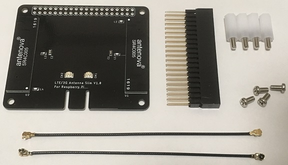
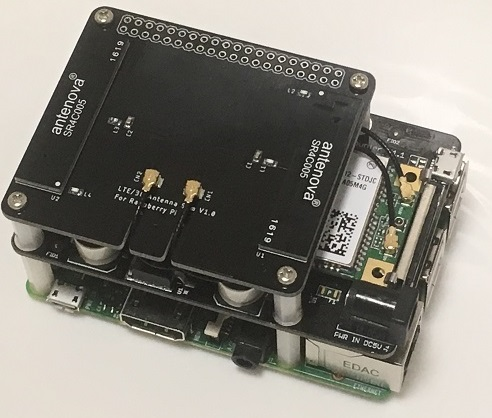

# LTE/3G Antenna Slim

## 0. 目次

1. 概要
2. 付属品
3. サポート

## 1. 概要
* [LTE/3G Card Mounter For Raspberry Pi](https://www.switch-science.com/catalog/3548/ "LTE/3G Card Mounter For Raspberry Pi")用に設計したアンテナシールドです。  
* 付属のU.FLケーブルを用いることで省スペースなアンテナ設置を実現します。  
* 寸法： 56mm x 65mm x 17.1mm(基盤下:13.5mm/スタッキングコネクタ実装時:基板上8.4mm)

## 2. 付属品
* LTE/3G Antenna Shield x 1
* スタッキングコネクタ x 1
* U.FLケーブル 10cm x 2
* Shield 固定ビス x 4
* Shield 固定スペーサー x 4

### 2.1 LTE/3Gカードについて
* 本製品は以下のモジュールに対し使用してください。

|デバイス|電波|
|:-----------|:-----------|
|EC21-J Mini PCIe|LTE|
|UC20-G Mini PCIe|3G|

以下のイメージは[LTE/3G Card Mounter For Raspberry Pi](https://www.switch-science.com/catalog/3548/ "LTE/3G Card Mounter For Raspberry Pi")と本製品を接続した図です。

## 3. サポート
本製品に関するご意見/お問い合わせはこちらの[メール](mailto:readsnow.dev@gmail.com)までお願い致します。
